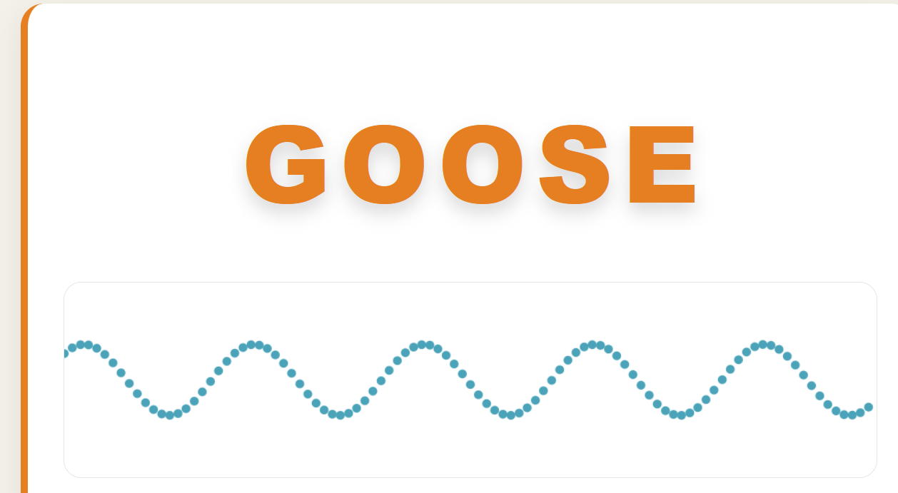
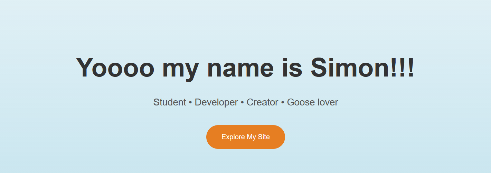
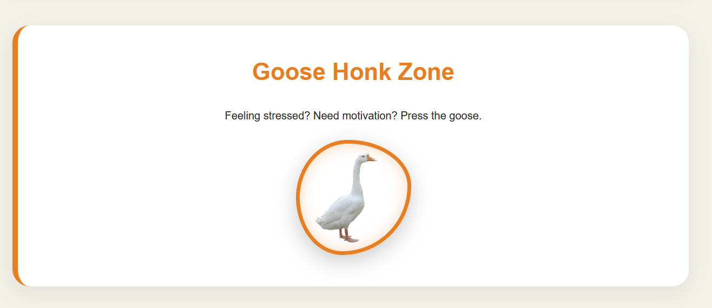

# 🪿 Gooose.org - My Goose Themed Website

Welcome to my personal goose-themed website!

This project is a modern portfolio website built using HTML, CSS, and JavaScript. It combines a personal portfolio with a fun goose theme, interactive animations, and a working honk button.

## Demo URL

https://xchicken669.github.io/my_goosed_website/

## ✨ Features

- 🪿 Custom goose-themed design
- 🎨 Modern CSS styling and animations
- 📱 Responsive layout
- 🔊 Interactive honk button with sound
- 🌊 Animated wave effect
- ✨ Hover animations
- 📂 Projects section

## 🛠️ Technologies Used

- HTML
- CSS
- JavaScript
- Canvas API

## 📁 Project Structure
my_goosed_website/
│
├── index.html
├── style.css
├── script.js
├── honk.mp3
├── goose.png

## 🚀 How to Run Locally

1. Download or clone this repository.
2. Open `index.html` in your browser.
3. Enjoy the goose website

## 👤 Author

Šimon Váňa

## 🪿 Credits

Created as a personal web development project.

Honk responsibly.

